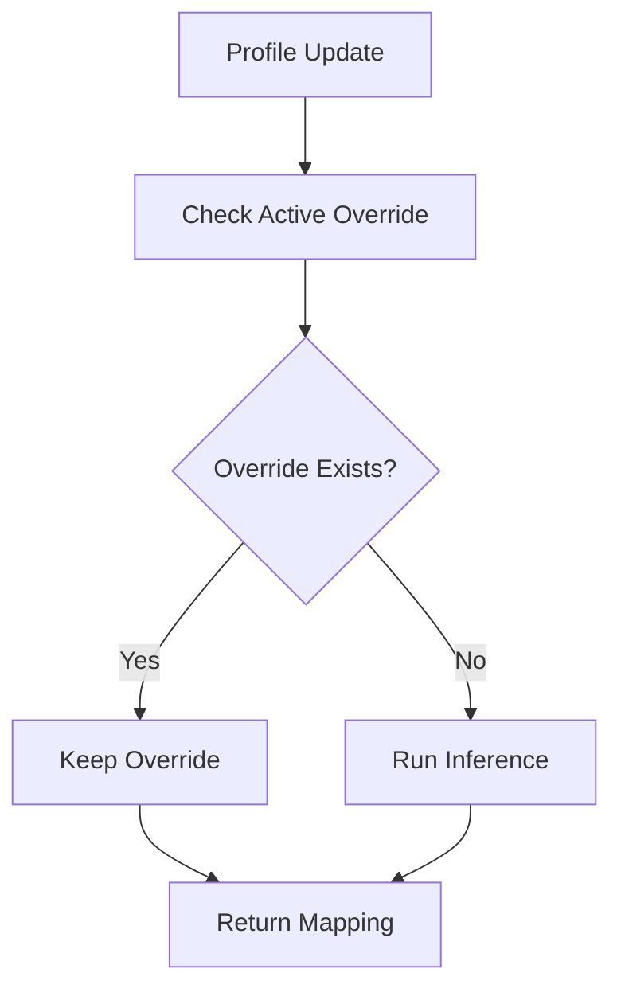
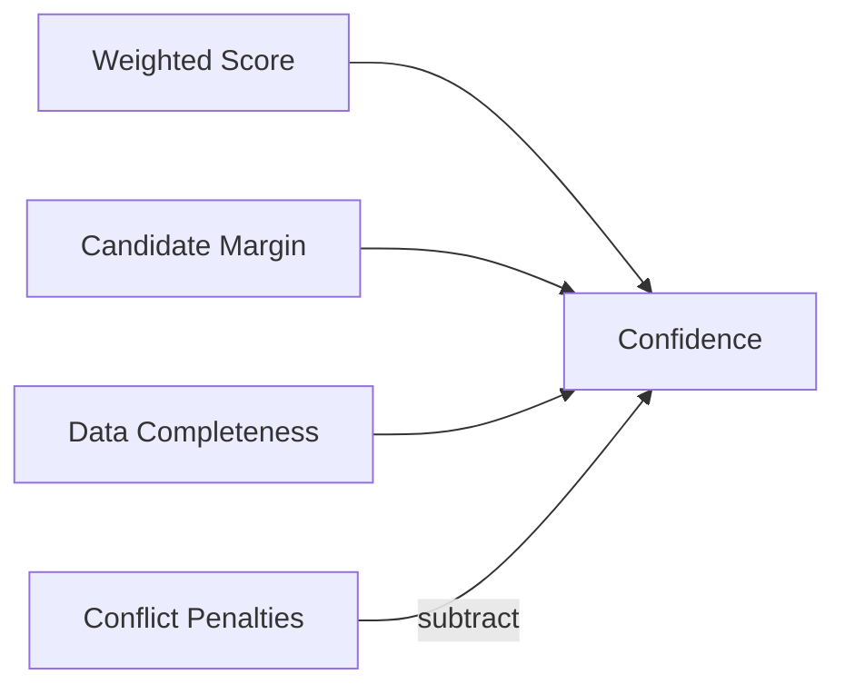

# Role Inference Service

Maps messy SSO user profiles to canonical Work Architecture roles with deterministic inference, confidence scoring, explanations, persisted state, and admin override/reset support.

This is backend-first because the assignment’s core risk is inference behavior, data modeling, auditability, and async handoff. The CLI demo and minimal React UI sit on top of the same API behavior.

## Business Problem

Enterprise SSO profiles are useful but messy. Okta, Microsoft Entra ID, and Google Workspace often return partial or inconsistent attributes because each company names jobs, departments, groups, and skills differently. The same role might appear as `Sr BI Analyst`, `Senior Analytics Specialist`, or `Data & Insights Analyst`, while generic titles like `Lead` or `Analyst` may hide very different responsibilities.

Canonical Work Architecture roles matter because downstream product behavior depends on them: feature access, recommended workflows, content, reporting, and AI assistant behavior can all change based on a user's role. Because the source data is noisy, the system must explain its reasoning, expose confidence, show alternatives, and allow an admin to override or reset mappings when human context beats automatic inference.

## Why Backend First?

The primary risk is not UI polish; it is whether the system makes role decisions transparently and safely. The backend owns inference correctness, confidence calibration, explanation quality, override behavior, persistence, and API contracts. I prioritized domain/API quality first so another engineer can understand, test, and extend the inference workflow asynchronously before investing in a more polished UI.

## Quick Start

```bash
npm install
npm run db:migrate
npm run db:seed
npm run dev
```

Health check:

```bash
curl http://localhost:3000/health
```

Run tests:

```bash
npm test
```

Run the walkthrough demo:

```bash
npm run demo
```

Open the minimal admin UI:

```txt
http://localhost:3000/
```

## Docker

```bash
docker compose up --build
```

The API listens on port `3000`. SQLite data is persisted in a Docker named volume.

## Demo

`npm run demo` resets demo state, seeds roles, ingests all assignment sample profiles, prints mappings, highlights hard cases, overrides `usr_007`, runs manual inference while the override remains pinned, and resets back to inferred mode.

Expected hard-case behavior:

- `usr_006`: `needs_review`
- `usr_007`: `needs_review`
- `usr_008`: `insufficient_data`

## Admin Experience

The root route `/` serves a small React admin experience. It is intentionally thin:

- loads roles and profiles through existing API endpoints
- bootstraps assignment sample profiles with `POST /profiles` only when no profiles exist
- shows selected role, source, status, confidence, explanation, signals, conflicts, and alternatives
- supports override through `POST /profiles/:id/override`
- supports reset through `POST /profiles/:id/reset`

The UI contains no inference, scoring, confidence, or persistence logic.

Screenshot placeholders for review handoff:

- Mapping Dashboard: `docs/screenshots/mapping-dashboard.png`
- Profile Details: `docs/screenshots/profile-details.png`
- Override Workflow: `docs/screenshots/override-workflow.png`
- Reset Workflow: `docs/screenshots/reset-workflow.png`

The dashboard table shows user, selected role, source, status, and confidence. Selecting a profile opens details with explanation, signals, conflicts, alternatives, and active override information. Override submits to `POST /profiles/:id/override`; reset submits to `POST /profiles/:id/reset`; both refresh the selected mapping after success.

## API

- `GET /health`
- `GET /roles`
- `GET /profiles`
- `POST /profiles`
- `POST /profiles/:id/infer`
- `GET /profiles/:id/mapping`
- `POST /profiles/:id/override`
- `POST /profiles/:id/reset`

`POST /profiles` upserts a profile and runs inference automatically unless an active override exists. Manual inference creates a new latest inference but does not remove an override. Reset deactivates the override and re-runs inference against the latest stored profile.

## Architecture

### Architecture Overview


### Override Flow



### Confidence Model



Core boundaries:

- `src/domain/*`: pure inference logic, no Fastify or Prisma dependency.
- `src/modules/*`: API orchestration and mapping workflow.
- `src/db/*`: Prisma client and persistence mappers.
- `src/data/*`: assignment sample roles and SSO profiles.
- `docs/*`: contracts, architecture, agent handoffs, and review guardrails.

`docs/contracts.md` is treated as the source of truth for shared API/domain shapes.

## Inference Pipeline

The classifier is deterministic-first. It does not ask an LLM to choose a role.

Signals used:

- title similarity
- department and job-family alignment
- seniority
- skills overlap
- group relevance
- manager title
- role keywords
- business unit
- notes

Confidence is not raw score only. It combines weighted signal score, margin from the second candidate, data completeness, and conflict penalties.

Statuses:

- `inferred`: strong confidence and clear winner
- `needs_review`: close candidates, conflicting signals, or moderate confidence
- `insufficient_data`: too few useful profile signals

Explanations are generated only from scoring signals that actually contributed.

## Persistence

Main records:

- `Role`
- `UserProfile`
- `RoleInference`
- `RoleOverride`

SQLite is used for local reproducibility. Some structured fields are stored as JSON strings in SQLite; `src/db/mappers.ts` parses/stringifies at the DB boundary so API and domain code still work with typed arrays/objects.

Prisma Client is used for ORM queries. Prisma CLI schema migration commands failed locally with an opaque schema-engine error, so local/Docker setup uses `prisma/apply-migration.ts` with Node 22 `node:sqlite` to apply an idempotent SQLite migration. This keeps `docker compose up --build` reliable for review.

## Tests

Current coverage:

- strong role matches
- all eight sample users
- ambiguous profiles
- insufficient data
- profile ingest
- manual inference
- current mapping resolution
- override
- reset
- manual inference while overridden keeps `source = "overridden"` and updates `latestInference`

Run:

```bash
npm test
```

## AI Usage

AI tools were used as engineering accelerators, not as the runtime classifier.

Used for:

- architecture review against the assignment
- multi-agent execution planning
- scaffold generation
- inference edge-case design
- test case generation
- code review checkpoints
- README and handoff refinement

Course corrections:

- User review caught Docker seed startup breakage because runtime used compiled files but `db:seed` referenced TS source.
- User review called out JSON-string persistence risk; DB mappers now enforce typed API/domain boundaries.
- Review checkpoint caught misleading department explanation text and noisy demo logs.
- Prisma migration CLI assumption was rejected after validation; custom SQLite migration was added for local reliability.

Token/context strategy:

- Caveman skill was installed and used as a basis for terse updates and scoped work.
- Work was split into agent-style phases to reduce repeated context: foundation, inference, API, demo, review.
- Review checkpoints were added before moving between phases.
- Highest-context phases were contracts/architecture, inference calibration, and final review.
- Lower-token improvement if repeated: keep shorter agent prompts in repo-local docs and avoid reloading the PDF after contracts are established.

## Assumptions

- Work Architecture roles are available locally as seeded data.
- SSO payloads may be incomplete, inconsistent, or noisy.
- Admin overrides are intentional and suppress automatic selected-role changes.
- Synchronous re-inference is enough for this take-home.
- Confidence must be explainable, not statistically perfect.
- CLI demo plus minimal React UI are sufficient admin surfaces for the assignment scope.

## Known Limitations

- No real SSO provider integration.
- No production auth or multi-tenancy.
- No background reprocessing queue.
- No full audit event stream.
- No OpenAPI spec.
- SQLite is local-only.
- Scoring weights are heuristic and need calibration against labeled data.
- Minimal UI is intentionally thin and API-only.

## What I Would Build Next

1. Labeled evaluation harness.
2. Admin review queue for `needs_review` and `insufficient_data`.
3. Audit log for ingest, inference, override, and reset events.
4. Background reprocessing for profile or Work Architecture changes.
5. OpenAPI documentation.
6. Postgres migration path.
7. Basic admin authentication.
8. Tracing around inference decisions.
9. Optional LLM-assisted explanation refinement without letting the LLM select the role.
